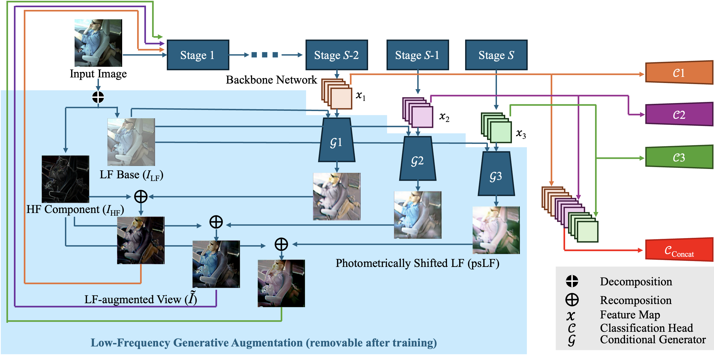

# Low-Frequency Generative Augmentation for Driver Distraction Recognition

This repository contains the official PyTorch implementation for the paper:

**Train Once, Apply Broadly: Low-Frequency Generative Augmentation for Driver Distraction Recognition under Photometric Shifts**



---

### Environment

This source code was tested in the following environment:

    Python = 3.10
    PyTorch = 1.11.0
    torchvision = 0.12.0
    Ubuntu 20.04.6 LTS
  
  ### Dataset

We use public driver distraction recognition datasets `AUC Distracted Driver (AUC-DDD)` and `State Farm Distracted Driver (SFD)` as the single labeled source.

For zero-shot video evaluation we use `Driver Monitoring Dataset (DMD)`.

For AUC-DDD and SFD, please organize the images as:
  ```
datasets/organized/
├── AUCD
│   ├── train
│   │   ├── safe_driving
│   │   ├── texting_right
│   │   ├── …
│   ├── validation
│   │   ├── safe_driving
│   │   ├── texting_right
│   │   ├── …
│   ├── AtoS
│   │   ├── safe_driving
│   │   ├── texting_right
│   │   ├── …
│   ├── AtoB
│   │   ├── safe_driving
│   │   ├── texting_right
│   │   ├── …
│   └── AtoL
│       ├── safe_driving
│       ├── texting_right
│       ├── …
└── SFD
    ├── train
    │   ├── safe_driving
    │   ├── texting_right
    │   ├── …
    ├── validation
    │   ├── safe_driving
    │   ├── texting_right
    │   ├── …
    ├── StoA
    │   ├── safe_driving
    │   ├── texting_right
    │   ├── …
    ├── StoB
    │   ├── safe_driving
    │   ├── texting_right
    │   ├── …
    └── StoL
        ├── safe_driving
        ├── texting_right
        ├── …
```
### Train

    python train.py --set AUCD
    python train.py --set SFD
   
   
